# 🎤 Ultra Audio Studio

### *AI-Powered Speech-to-Speech Translation Platform*

[](https://www.python.org/)
[](https://fastapi.tiangolo.com/)
[](https://streamlit.io/)
[](https://azure.microsoft.com/)
[](LICENSE)

---

## 📋 Table of Contents

1. [🌟 Project Introduction](#-project-introduction)
2. [🎥 Demo Video](#-demo-video)
3. [✨ Key Features](#-key-features)
4. [🛠️ Tech Stack](#-tech-stack)
5. [🏗️ System Architecture](#-system-architecture)
6. [🔄 Speech-to-Speech Pipeline](#-speech-to-speech-pipeline)
7. [📦 Installation & Setup](#-installation--setup)
8. [🚀 Quick Start](#-quick-start)
9. [📸 Screenshots](#-screenshots)
10.[📄 License & Credits](#-license--credits) 

---

## 🌟 Project Introduction

**Ultra Audio Studio** is a cutting-edge **AI-powered Speech-to-Speech Translation Platform** that leverages Azure Cognitive Services, advanced machine learning, and real-time processing to break language barriers instantly.

## Demo Link
https://ultraaudiostudio.streamlit.app/

### 🎯 What We Do

Transform speech from one language to another **in real-time** without compromising on:
- 🗣️ Natural voice quality and emotion
- ⚡ Low latency (sub-second processing)
- 🌍 Multi-language support
- 🎚️ Voice customization and personalization

### 💡 Key Value Propositions

| Use Case | Benefit |
|----------|---------|
| 🔴 **Live Stream Translation** | Break language barriers for global audiences in real-time |
| 🎬 **Content Dubbing** | Auto-dub videos & podcasts in multiple languages instantly |
| 🎙️ **Voice Recording & Dubbing** | Create professional dubbed content from simple voice recordings |
| 👥 **Remote Meeting Translation** | Real-time translation for international team collaboration |
| 📊 **Live Analytics** | Monitor metrics, latency, and performance in real-time |

---

## 🎥 Demo Video

https://github.com/user-attachments/assets/13535ca0-0c07-4505-b8ac-f579900c5f2d

---

## ✨ Key Features

### 🎤 **Live Speech Translation**
- Real-time Speech → Text → Translation → Speech pipeline
- Ultra-low latency for seamless communication
- Continuous streaming support with chunked processing

### 🎬 **Media Auto-Dubbing**
- Upload video/audio files and auto-dub in target language
- Automatic speaker detection and voice cloning
- Batch processing for multiple files

### 🎙️ **Instant Voice Dubbing**
- Record audio directly and generate translated speech
- One-click translation workflow
- Instant playback preview

### 👥 **Remote Meeting Translation**
- Room-based real-time translation
- Multi-participant support
- Live transcription logs

### 📊 **Advanced Analytics & Monitoring**
- Real-time performance metrics
- Latency tracking and optimization
- Processing logs and error reporting
- Session history and statistics

### 🎚️ **Voice Customization**
- Emotion control (Neutral, Happy, Sad, Angry)
- Speed adjustment (0.5x - 2.0x)
- Pitch modification
- Multiple voice options per language

### 🌍 **Multi-Language Support**
- 50+ languages supported
- Neural Machine Translation (NMT)
- High-quality voice synthesis

### 📝 **SRT Subtitle Generation**
- Automatic subtitle file generation
- Timing synchronization
- Multi-language subtitle tracks

---

## 🛠️ Tech Stack

### **Frontend**
| Technology | Purpose |
|------------|---------|
|  | Interactive web UI & dashboards |
|  | Core application logic |
|  | Real-time analytics visualization |

### **Backend APIs**
| Technology | Purpose |
|------------|---------|
|  | High-performance REST APIs |
|  | Live stream communication |
|  | Backend core logic |

### **AI & ML Services**
| Service | Role |
|---------|------|
|  | Automatic Speech Recognition (ASR) |
|  | Neural Machine Translation (NMT) |
|  | Neural Text-to-Speech (TTS) |

### **Data & Storage**
| Technology | Purpose |
|------------|---------|
|  | Session history and analytics |
|  | Configuration and data serialization |

### **Media Processing**
| Library | Purpose |
|---------|---------|
| MoviePy | Video/Audio manipulation |
| SoundFile | Audio file I/O |
| Noisereduce | Audio enhancement |
| FFmpeg | Media encoding/decoding |

### **Deployment & Compute**
| Platform | Purpose |
|----------|---------|
|  | Compute and services hosting |
|  | Application containerization |
|  | Source code management |

---

## 🏗️ System Architecture

### High-Level Overview

```
┌─────────────────────────────────────────────────────────────────┐
│                     Ultra Audio Studio                          │
├─────────────────────────────────────────────────────────────────┤
│                                                                 │
│  ┌──────────────────────────────────────────────────────────┐  │
│  │            FRONTEND (Streamlit Web UI)                  │  │
│  │  ┌─────────────┐  ┌──────────────┐  ┌──────────────┐    │  │
│  │  │Live Stream  │  │Record & Dub  │  │Batch Studio  │    │  │
│  │  └─────────────┘  └──────────────┘  └──────────────┘    │  │
│  │  ┌─────────────┐  ┌──────────────┐  ┌──────────────┐    │  │
│  │  │Remote Mtg   │  │Analytics     │  │History       │    │  │
│  │  └─────────────┘  └──────────────┘  └──────────────┘    │  │
│  └──────────────────────────────────────────────────────────┘  │
│                         │                                       │
│                         ▼                                       │
│  ┌──────────────────────────────────────────────────────────┐  │
│  │            BACKEND (FastAPI + WebSockets)               │  │
│  │  ┌─────────────────────────────────────────────────┐    │  │
│  │  │   Speech-to-Speech Pipeline Orchestrator        │    │  │
│  │  └─────────────────────────────────────────────────┘    │  │
│  └──────────────────────────────────────────────────────────┘  │
│                         │                                       │
│         ┌───────────────┼───────────────┐                       │
│         ▼               ▼               ▼                       │
│  ┌─────────────┐ ┌─────────────┐ ┌──────────────┐             │
│  │   ASR       │ │   NMT       │ │    TTS       │             │
│  │ (Speech→Txt)│ │ (Txt→Txt)   │ │ (Txt→Speech) │             │
│  │   Azure     │ │   Azure     │ │   Azure      │             │
│  └─────────────┘ └─────────────┘ └──────────────┘             │
│                                                                 │
│  ┌──────────────────────────────────────────────────────────┐  │
│  │     PROCESSING MODULES                                  │  │
│  │  ┌──────────────┐  ┌──────────────┐  ┌──────────────┐  │  │
│  │  │Scene Detect  │  │Speaker ID    │  │Emotion Ctrl  │  │  │
│  │  └──────────────┘  └──────────────┘  └──────────────┘  │  │
│  │  ┌──────────────┐  ┌──────────────┐  ┌──────────────┐  │  │
│  │  │Lip Sync Gen  │  │SRT Generator │  │Noise Reduce  │  │  │
│  │  └──────────────┘  └──────────────┘  └──────────────┘  │  │
│  └──────────────────────────────────────────────────────────┘  │
│                                                                 │
│  ┌──────────────────────────────────────────────────────────┐  │
│  │     DATA STORAGE & LOGGING                              │  │
│  │  ┌──────────────┐  ┌──────────────┐  ┌──────────────┐  │  │
│  │  │SQLite DB     │  │Session Logs  │  │Analytics    │  │  │
│  │  │(History)     │  │(Metrics)     │  │(Statistics) │  │  │
│  │  └──────────────┘  └──────────────┘  └──────────────┘  │  │
│  └──────────────────────────────────────────────────────────┘  │
│                                                                 │
└─────────────────────────────────────────────────────────────────┘
```

### Core Modules

| Module | Responsibility | File |
|--------|-----------------|------|
| 🎬 **Pipeline** | Orchestrates end-to-end speech translation | `ultraaudio/pipeline.py` |
| 🎙️ **Scene Detection** | Detects speaker changes and scene breaks | `ultraaudio/scene_detection.py` |
| 👤 **Speaker ID** | Identifies and tracks speakers | `ultraaudio/speaker_id.py` |
| 😊 **Emotion** | Controls emotional tone of output speech | `ultraaudio/emotion.py` |
| 👁️ **Lip Sync** | Generates lip-sync data for video dubbing | `ultraaudio/lipsync.py` |
| 📝 **SRT Utils** | Generates subtitle files | `ultraaudio/srt_utils.py` |
| ⚙️ **Config** | Centralized configuration management | `ultraaudio/config.py` |
| 🛠️ **Utils** | Helper functions and utilities | `ultraaudio/utils.py` |

---

## 🔄 Speech-to-Speech Pipeline

### Complete Data Flow

```mermaid
graph TD
    A["🎤 AUDIO INPUT<br/>(Live Stream / File Upload / Recording)"] --> B["1️⃣ AUDIO PREPROCESSING<br/>• Split into chunks 15-30 sec<br/>• Noise reduction & normalization<br/>• Format: WAV, PCM-16, 16kHz"]
    
    B --> C["2️⃣ AUTOMATIC SPEECH RECOGNITION<br/>• Azure Speech Services API<br/>• Source Language Detection<br/>• Transcribed Text Output<br/>• Confidence Scoring"]
    
    C --> D["3️⃣ NEURAL MACHINE TRANSLATION<br/>• Azure Translator API<br/>• Source → Target Language<br/>• Context-aware translation<br/>• Translated Text Output"]
    
    D --> E["4️⃣ VOICE CUSTOMIZATION<br/>• Emotion: Neutral/Happy/Sad/Angry<br/>• Speed: 0.5x - 2.0x<br/>• Pitch Modification<br/>• Voice Variant Selection"]
    
    E --> F["5️⃣ TEXT-TO-SPEECH SYNTHESIS<br/>• Azure Neural TTS<br/>• Natural Speech Generation<br/>• Audio: WAV/MP3<br/>• Timing Info for Sync"]
    
    F --> G["6️⃣ AUDIO POSTPROCESSING<br/>• Combine Audio Chunks<br/>• Volume Normalization<br/>• Quality Optimization<br/>• Format Encoding"]
    
    G --> H{Optional<br/>Video Dub?}
    H -->|Yes| I["7️⃣ VIDEO DUBBING + LIP-SYNC<br/>• Speaker Region Detection<br/>• Lip-sync Animation<br/>• Audio Overlay<br/>• Dubbed Video Output"]
    H -->|No| J{Optional<br/>Subtitles?}
    
    I --> J{Optional<br/>Subtitles?}
    J -->|Yes| K["8️⃣ SUBTITLE GENERATION<br/>• SRT File Generation<br/>• Timing Sync<br/>• Multi-language Tracks"]
    J -->|No| L["9️⃣ LOGGING & ANALYTICS<br/>• Processing Time per Step<br/>• API Latency Tracking<br/>• Session Metadata Storage<br/>• Performance Reports"]
    K --> L
    
    L --> M["🔊 FINAL OUTPUT<br/>Translated Speech + Optional Video/Subtitles"]
    
    style A fill:#4CAF50,stroke:#2E7D32,stroke-width:3px,color:#fff
    style B fill:#2196F3,stroke:#1565C0,stroke-width:2px,color:#fff
    style C fill:#2196F3,stroke:#1565C0,stroke-width:2px,color:#fff
    style D fill:#2196F3,stroke:#1565C0,stroke-width:2px,color:#fff
    style E fill:#FF9800,stroke:#E65100,stroke-width:2px,color:#fff
    style F fill:#2196F3,stroke:#1565C0,stroke-width:2px,color:#fff
    style G fill:#9C27B0,stroke:#6A1B9A,stroke-width:2px,color:#fff
    style H fill:#FFC107,stroke:#F57F17,stroke-width:2px,color:#000
    style I fill:#FF5722,stroke:#D84315,stroke-width:2px,color:#fff
    style J fill:#FFC107,stroke:#F57F17,stroke-width:2px,color:#000
    style K fill:#00BCD4,stroke:#00838F,stroke-width:2px,color:#fff
    style L fill:#673AB7,stroke:#4527A0,stroke-width:2px,color:#fff
    style M fill:#4CAF50,stroke:#2E7D32,stroke-width:3px,color:#fff
```



### Processing Architecture - Parallel Chunked Processing

```mermaid
graph TD
    INPUT["📥 INPUT AUDIO STREAM"] --> SPLIT["🔀 Split into Chunks<br/>Chunk 1, Chunk 2, ..., Chunk N"]
    
    SPLIT --> P1["⚙️ PARALLEL PROCESSING<br/>Chunk 1"]
    SPLIT --> P2["⚙️ PARALLEL PROCESSING<br/>Chunk 2"]
    SPLIT --> PN["⚙️ PARALLEL PROCESSING<br/>Chunk N"]
    
    P1 --> ASR1["🎤 ASR<br/>Speech → Text"]
    P2 --> ASR2["🎤 ASR<br/>Speech → Text"]
    PN --> ASRN["🎤 ASR<br/>Speech → Text"]
    
    ASR1 --> NMT1["🌍 NMT<br/>Translate"]
    ASR2 --> NMT2["🌍 NMT<br/>Translate"]
    ASRN --> NMTN["🌍 NMT<br/>Translate"]
    
    NMT1 --> TTS1["🔊 TTS<br/>Text → Speech"]
    NMT2 --> TTS2["🔊 TTS<br/>Text → Speech"]
    NMTN --> TTSN["🔊 TTS<br/>Text → Speech"]
    
    TTS1 --> OUT1["📤 Output 1"]
    TTS2 --> OUT2["📤 Output 2"]
    TTSN --> OUTN["📤 Output N"]
    
    OUT1 --> MERGE["🔗 MERGE & SYNCHRONIZE<br/>Combine chunks with timing"]
    OUT2 --> MERGE
    OUTN --> MERGE
    
    MERGE --> FINAL["✅ FINAL TRANSLATED SPEECH<br/>+ Optional: Video Dub + Subtitles + Analytics"]
    
    style INPUT fill:#4CAF50,stroke:#2E7D32,stroke-width:3px,color:#fff
    style SPLIT fill:#2196F3,stroke:#1565C0,stroke-width:2px,color:#fff
    style P1 fill:#FFC107,stroke:#F57F17,stroke-width:2px,color:#000
    style P2 fill:#FFC107,stroke:#F57F17,stroke-width:2px,color:#000
    style PN fill:#FFC107,stroke:#F57F17,stroke-width:2px,color:#000
    style ASR1 fill:#FF5722,stroke:#D84315,stroke-width:2px,color:#fff
    style ASR2 fill:#FF5722,stroke:#D84315,stroke-width:2px,color:#fff
    style ASRN fill:#FF5722,stroke:#D84315,stroke-width:2px,color:#fff
    style NMT1 fill:#00BCD4,stroke:#00838F,stroke-width:2px,color:#fff
    style NMT2 fill:#00BCD4,stroke:#00838F,stroke-width:2px,color:#fff
    style NMTN fill:#00BCD4,stroke:#00838F,stroke-width:2px,color:#fff
    style TTS1 fill:#9C27B0,stroke:#6A1B9A,stroke-width:2px,color:#fff
    style TTS2 fill:#9C27B0,stroke:#6A1B9A,stroke-width:2px,color:#fff
    style TTSN fill:#9C27B0,stroke:#6A1B9A,stroke-width:2px,color:#fff
    style OUT1 fill:#673AB7,stroke:#4527A0,stroke-width:2px,color:#fff
    style OUT2 fill:#673AB7,stroke:#4527A0,stroke-width:2px,color:#fff
    style OUTN fill:#673AB7,stroke:#4527A0,stroke-width:2px,color:#fff
    style MERGE fill:#FF9800,stroke:#E65100,stroke-width:2px,color:#fff
    style FINAL fill:#4CAF50,stroke:#2E7D32,stroke-width:3px,color:#fff
```



---

## 📦 Installation & Setup

### Prerequisites

- **Python**: 3.9 or higher
- **Operating System**: Windows, macOS, or Linux
- **RAM**: Minimum 8GB (16GB recommended)
- **Storage**: 5GB free space for models and temporary files
- **Internet**: Required for Azure services

### Step 1: Clone the Repository

```powershell
git clone https://github.com/vidzai/ultra-audio-studio.git
cd ultra-audio-studio
```

### Step 2: Create a Python Virtual Environment

```powershell
# Create virtual environment
python -m venv venv

# Activate virtual environment
# On Windows:
venv\Scripts\Activate.ps1

# On macOS/Linux:
source venv/bin/activate
```

### Step 3: Install Dependencies

```powershell
# Install Python packages
pip install -r requirements.txt

# Install backend-specific dependencies
pip install -r scripts/backend/requirements.txt
```

### Step 4: Configure Azure Services

You need Azure Cognitive Services credentials for Speech, Translator, and Text-to-Speech APIs.

#### Option A: Environment Variables (Recommended)

Create a `.env` file in the project root:

```env
# Azure Speech Services
AZURE_SPEECH_KEY=your_speech_key_here
AZURE_SPEECH_REGION=eastus

# Azure Translator
AZURE_TRANSLATOR_KEY=your_translator_key_here
AZURE_TRANSLATOR_REGION=eastus

# Azure Text-to-Speech (usually same as Speech Services)
AZURE_TTS_KEY=your_tts_key_here
AZURE_TTS_REGION=eastus
```

#### Option B: Configuration File

Edit `scripts/backend/ultraaudio/config.py`:

```python
# Load from config.py
AZURE_SPEECH_KEY = "your_key"
AZURE_SPEECH_REGION = "eastus"
AZURE_TRANSLATOR_KEY = "your_key"
# ... etc
```

#### Getting Azure Keys

1. Go to [Azure Portal](https://portal.azure.com)
2. Create or select a **Cognitive Services** resource
3. Copy your **API Key** and **Region**
4. Add to `.env` or `config.py`

### Step 5: Install System Dependencies (Optional but Recommended)

```powershell
# Install FFmpeg (required for video processing)
# On Windows (using Chocolatey):
choco install ffmpeg

# On macOS (using Homebrew):
brew install ffmpeg

# On Linux (Ubuntu/Debian):
sudo apt-get install ffmpeg
```

### Step 6: Verify Installation

```powershell
python -c "import streamlit; import fastapi; print('✅ Installation successful!')"
```

---

## 🚀 Quick Start

### Start the Application

```powershell
# Navigate to the project directory
cd c:\Users\HP\OneDrive\Desktop\Spring Boot\speechtranslation

# Run the main application
python scripts/backend/app.py
```

The Streamlit app will launch at: **http://localhost:8501**

### First Time Setup Checklist

- [ ] Azure keys configured in `.env` or `config.py`
- [ ] Virtual environment activated
- [ ] All dependencies installed (`pip install -r requirements.txt`)
- [ ] FFmpeg installed (for video/audio processing)
- [ ] Internet connection available

### Running Tests

```powershell
# Run pipeline debug tests
python scripts/backend/test_pipeline_debug.py

# Run backend tests
pytest scripts/backend/ -v

# Run with coverage
pytest scripts/backend/ --cov=scripts.backend --cov-report=html
```

---
## 📸 Screenshots
### Video Dub


### Dashboard Overview


### Record & Dub Interface


### Live Stream


### History


### Analytics Dashboard


### Batch Studio Player


---

## 📄 License & Credits

### 📜 Software License

```
MIT License

Copyright (c) 2025 Vidzai Digital

Permission is hereby granted, free of charge, to any person obtaining a copy
of this software and associated documentation files (the "Software"), to deal
in the Software without restriction, including without limitation the rights
to use, copy, modify, merge, publish, distribute, sublicense, and/or sell
copies of the Software, and to permit persons to whom the Software is
furnished to do so, subject to the following conditions:

The above copyright notice and this permission notice shall be included in
all copies or substantial portions of the Software.

THE SOFTWARE IS PROVIDED "AS IS", WITHOUT WARRANTY OF ANY KIND, EXPRESS OR
IMPLIED, INCLUDING BUT NOT LIMITED TO THE WARRANTIES OF MERCHANTABILITY,
FITNESS FOR A PARTICULAR PURPOSE AND NONINFRINGEMENT. IN NO EVENT SHALL THE
AUTHORS OR COPYRIGHT HOLDERS BE LIABLE FOR ANY CLAIM, DAMAGES OR OTHER
LIABILITY, WHETHER IN AN ACTION OF CONTRACT, TORT OR OTHERWISE, ARISING FROM,
OUT OF OR IN CONNECTION WITH THE SOFTWARE OR THE USE OR OTHER DEALINGS IN
THE SOFTWARE.
```
---
## ⭐ Star Us!

If you find this project helpful, please consider giving it a ⭐ on [GitHub](https://github.com/vidzai/ultra-audio-studio)!

---

<div align="center">

**Made with ❤️ by Infosys Springboard Team**

*Breaking Language Barriers Through AI* 🌍🎤

**Happy Translating! 🗣️✨**

</div>
