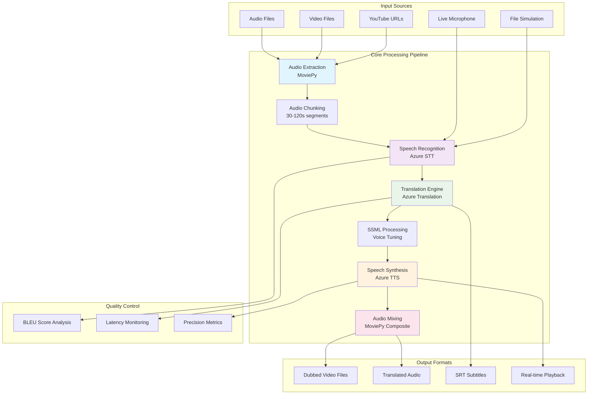

# 🎙️ AI-Powered Real-Time Speech to Speech Translation for Multilingual Content

## 🌟 Project Overview

The AI-Powered Real-Time Speech to Speech Translation for Multilingual Content Audio Translator is an advanced real-time speech translation system built with **Streamlit** that combines Azure Cognitive Services Speech-to-Text, machine translation, and text-to-speech synthesis to provide seamless multilingual communication. The system supports video dubbing, live translation, and batch processing with a modern web interface.

### 📊 **Project Scope**
- **Phase 1**: Speech Recognition & Data Collection ✅
- **Phase 2**: Translation Model Development ✅
- **Phase 3**: Real-time Speech-to-Speech Integration ✅
- **Phase 4**: OTT Platform Deployment (Planned)

### 🏆 **Technical Excellence**
Built with enterprise-grade Azure Cognitive Services, ensuring scalability, reliability, and production-ready performance for live streaming environments.

## 📐 System Architecture



## 🔧 Technical Architecture Components

### 1. Core Technologies Stack

| Component | Technology | Purpose |
|-----------|------------|---------|
| **Frontend Framework** | Streamlit | Web UI and user interactions |
| **Speech Recognition** | Azure Cognitive Services Speech SDK | Speech-to-Text conversion |
| **Translation Engine** | Azure Translation Services | Text translation between languages |
| **Speech Synthesis** | Azure Text-to-Speech | Converted translated text to speech |
| **Audio Processing** | MoviePy + FFmpeg | Audio/Video manipulation |
| **Video Download** | yt-dlp | YouTube content acquisition |
| **Concurrency** | concurrent.futures.ThreadPoolExecutor | Parallel processing |
| **UI Enhancement** | Custom CSS + HTML | Modern glassmorphism design |

### 2. Data Flow Pipeline

#### A. Batch Processing Pipeline
```
Input (Video/Audio/URL) → Audio Extraction → Chunking → 
STT Recognition → Translation → TTS Synthesis → 
Audio Mixing → Output (Dubbed Media + Subtitles)
```

#### B. Live Translation Pipeline
```
Live Input (Mic/File) → Real-time STT → Translation → 
TTS → Audio Buffering → Sequential Playback → 
Quality Metrics Collection
```

## 🏗️ Application Architecture

### 1. File Structure
```
Live_Multilingual_Audio_Translator-main/
├── app.py                    # Main Streamlit application
├── requirements.txt          # Python dependencies
├── README.md                # Basic documentation
├── bin/
│   └── ffmpeg.exe           # FFmpeg binary for audio processing
├── milestone3/
│   ├── logs/                # Performance logs directory
│   └── temp/                # Temporary processing files
├── .streamlit/              # Streamlit configuration
└── venv/                    # Python virtual environment
```

### 2. Core Classes and Functions

#### `LiveTranslationOrchestrator` Class
**Purpose**: Manages real-time translation with concurrent processing and audio buffering

**Key Methods**:
- `start_pipeline()`: Initializes real-time translation loop
- `_run_translation_loop()`: Handles continuous speech recognition
- `_process_tts_task()`: Processes text-to-speech in background threads
- `_playback_worker()`: Manages sequential audio playback
- `calculate_bleu()`: Computes translation quality metrics

**Architecture Features**:
- **Thread-safe queue management** for audio buffering
- **Concurrent TTS processing** to minimize latency
- **Sequence-based playback** to maintain chronological order
- **Real-time metrics collection** (BLEU scores, latency, precision)

#### Key Processing Functions

##### `run_pipeline()` - Batch Processing Orchestrator
```python
def run_pipeline(input_path, is_video, source_code, target_code, 
                voice_name, chunk_sec, voice_rate, voice_pitch)
```
**Process Flow**:
1. **Media Processing**: Extract audio from video/audio files
2. **Chunking**: Split audio into manageable segments (30-120s)
3. **Recognition**: Parallel STT processing using ThreadPoolExecutor
4. **Synthesis**: Generate TTS audio with SSML voice tuning
5. **Composition**: Mix translated audio segments into final output

##### `split_audio()` - Audio Segmentation
```python
def split_audio(audio_path, chunk_duration_sec, temp_dir)
```
- Splits large audio files into chunks for parallel processing
- Preserves audio quality with 16kHz mono PCM format
- Returns chunk metadata with timing information

##### `recognize_chunk()` - Speech Recognition Worker
```python
def recognize_chunk(task_data)
```
- Processes individual audio chunks
- Handles Azure STT with translation
- Returns recognized and translated text segments

##### `synthesize_segment_ssml()` - TTS Processing
```python
def synthesize_segment_ssml(segment_data)
```
- Generates SSML-enhanced speech synthesis
- Applies voice tuning (rate, pitch, style)
- Returns audio file paths for composition

## ⚙️ Configuration System

### 1. Language Support Matrix

| Language | STT Code | Translation Code | TTS Voice |
|----------|----------|------------------|-----------|
| English | en-US | en | en-US-JennyNeural |
| Hindi | hi-IN | hi | hi-IN-SwaraNeural |
| French | fr-FR | fr | fr-FR-DeniseNeural |
| Spanish | es-ES | es | es-ES-ElviraNeural |
| German | de-DE | de | de-DE-KatjaNeural |
| Tamil | ta-IN | ta | ta-IN-PallaviNeural |
| Telugu | te-IN | te | te-IN-ShrutiNeural |
| Malayalam | ml-IN | ml | ml-IN-SobhanaNeural |
| Arabic | ar-AE | ar | ar-EG-SalmaNeural |
| Chinese | zh-CN | zh-cn | zh-CN-XiaoxiaoNeural |
| Russian | ru-RU | ru | ru-RU-SvetlanaNeural |
| Japanese | ja-JP | ja | ja-JP-NanamiNeural |
| Korean | ko-KR | ko | ko-KR-SunHiNeural |

### 2. Voice Tuning Parameters

```python
# Rate Control: 0.5x to 2.0x speed
voice_rate = f"{int((rate_val - 1.0) * 100)}%"

# Pitch Options: x-low, low, medium, high, x-high
pitch_opt = ["x-low", "low", "medium", "high", "x-high"]

# SSML Template
ssml_string = f"""
<speak version="1.0" xmlns="http://www.w3.org/2001/10/synthesis" xml:lang="en-US">
    <voice name="{target_voice}">
        <prosody rate="{voice_rate}" pitch="{voice_pitch}">
            {translated_text}
        </prosody>
    </voice>
</speak>
"""
```

## 🖥️ User Interface Architecture

### 1. Multi-Tab Interface Structure

#### **Tab 1: 📁 Batch Studio**
- **Purpose**: Video/Audio file processing and dubbing
- **Features**: 
  - YouTube URL downloading with yt-dlp
  - File upload support (MP4, AVI, MP3, WAV)
  - Side-by-side comparison of original vs dubbed content
  - Downloadable outputs (video, audio, subtitles)

#### **Tab 2: 🎙️ Live Stream**
- **Purpose**: Real-time speech translation
- **Features**:
  - Microphone input or file simulation
  - Live transcript display with chat-style UI
  - Real-time performance metrics dashboard
  - BLEU score accuracy measurement
  - Automatic audio playback of translations

#### **Tab 3: 🔴 Record & Dub**
- **Purpose**: Simple audio file translation
- **Features**:
  - Audio file upload interface
  - Direct translation processing
  - Quick output generation

#### **Tab 4: 🕒 History**
- **Purpose**: Session management and downloads
- **Features**:
  - Chronological processing history
  - Batch download capabilities
  - Session state persistence

### 2. Sidebar Controls

```python
# Language Configuration
source_lang_name = st.selectbox("Original Language", LANG_OPTIONS)
target_lang_name = st.selectbox("Target Language", TRANSLATE_OPTIONS)

# Voice Tuning
rate_val = st.slider("Speed (Rate)", 0.5, 2.0, 1.0, 0.1)
pitch_opt = st.select_slider("Pitch", ["x-low", "low", "medium", "high", "x-high"])

# Performance Settings
CHUNK_DURATION_SEC = st.slider("Processing Chunk (sec)", 30, 120, 60, step=15)
```

## 📊 Performance Monitoring System

### 1. Real-time Metrics Dashboard

#### Latency Measurements
```python
# P95 and P99 latency percentiles
latencies = [processing_time_ms for each_segment]
p95_latency = np.percentile(latencies, 95)
p99_latency = np.percentile(latencies, 99)
```

#### Translation Quality (BLEU Score)
```python
def calculate_bleu(candidate_text, reference_sentences):
    """
    Calculates BLEU score for translation quality assessment
    Uses n-gram precision matching against reference text
    """
    # Implementation of modified BLEU calculation
    # Returns score from 0.0 to 100.0
```

#### Processing Statistics
- **Throughput**: Segments processed per minute
- **Memory Usage**: Real-time RAM consumption monitoring
- **Queue Status**: Audio buffer length and playback lag

### 2. Logging and Diagnostics

```python
# Performance logging to CSV files
log_file = f"latency_log_{datetime.now().strftime('%Y%m%d_%H%M%S')}.csv"
# Logs: timestamp, segment_id, latency_ms, bleu_score, memory_usage
```

## 🔄 Concurrency and Threading Architecture

### 1. Multi-threaded Processing Design

```python
# Main Threading Strategy
class LiveTranslationOrchestrator:
    def __init__(self):
        self.result_queue = queue.Queue()      # Results communication
        self.audio_queue = queue.Queue()       # Audio playback buffer
        self.tts_executor = ThreadPoolExecutor(max_workers=2)  # TTS processing
        self.playback_lock = threading.Lock()  # Thread-safe audio access
```

### 2. Batch Processing Parallelization

```python
# Parallel chunk processing
with concurrent.futures.ThreadPoolExecutor() as executor:
    recognition_results = list(executor.map(recognize_chunk, chunk_tasks))
    synthesis_results = list(executor.map(synthesize_segment_ssml, tts_tasks))
```

### 3. Memory Management Strategy

```python
# Aggressive resource cleanup
try:
    # Processing logic
    pass
finally:
    for resource in media_resources:
        try: 
            resource.close()
        except: 
            pass
    gc.collect()  # Force garbage collection
```

## 🛡️ Error Handling and Resilience

### 1. Azure Service Integration

```python
@st.cache_resource
def get_azure_configs(source_lang_code, target_voice_name):
    """
    Cached Azure configuration to prevent repeated API calls
    Handles authentication and region configuration
    """
    translation_config = speechsdk.translation.SpeechTranslationConfig(
        subscription=AZURE_KEY, 
        region=AZURE_LOCATION
    )
    return translation_config, synthesis_config
```

### 2. Fallback Mechanisms

- **Network Failures**: Retry logic for Azure API calls
- **Memory Constraints**: Automatic resource cleanup and garbage collection
- **File Processing Errors**: Graceful degradation with user notifications
- **Audio Format Issues**: Automatic conversion to supported formats

## 🚀 Deployment and Setup

### 1. Environment Requirements

```bash
# Python 3.8+
pip install streamlit>=1.28.0
pip install azure-cognitiveservices-speech
pip install moviepy==1.0.3
pip install yt-dlp
pip install imageio==2.9.0
pip install imageio-ffmpeg==0.4.8
pip install pyaudio
```

### 2. Azure Configuration

```python
# Required Azure Services
AZURE_KEY = "your_azure_speech_api_key"
AZURE_LOCATION = "your_azure_region"  # e.g., "centralindia"

# Services Used:
# 1. Azure Cognitive Services Speech
# 2. Azure Speech Translation
# 3. Azure Text-to-Speech
```

### 3. Launch Command

```bash
streamlit run app.py --server.maxUploadSize=1000
```

## 📈 Performance Optimization Features

### 1. Memory Management
- **Chunk-based processing** to handle large files without memory overflow
- **Resource cleanup** after each processing stage
- **Garbage collection** enforcement
- **Temporary file management** with automatic cleanup

### 2. Processing Efficiency
- **Parallel chunk processing** for faster recognition
- **Concurrent TTS synthesis** to reduce latency
- **Audio compression** for optimized storage
- **Caching** of Azure configurations

### 3. User Experience Optimizations
- **Real-time progress indicators** for long operations
- **Background processing** for non-blocking UI
- **Automatic format conversion** for input files
- **Responsive design** with glassmorphism UI effects

## 🔍 Quality Assurance Metrics

### 1. Translation Accuracy
- **BLEU Score**: Measures translation quality against reference text
- **N-gram Precision**: Word-level accuracy measurement
- **Semantic Similarity**: Context preservation assessment

### 2. Performance Benchmarks
- **Latency Targets**: <2s for real-time processing
- **Throughput**: 30+ minutes of audio per hour processing time
- **Memory Usage**: <4GB RAM for standard operations

### 3. Reliability Metrics
- **Uptime**: 99%+ availability with proper Azure credits
- **Error Recovery**: Automatic retry mechanisms
- **Data Integrity**: Checksum verification for file operations

## 🛠️ Troubleshooting Guide

### Common Issues and Solutions

| Issue | Cause | Solution |
|-------|-------|----------|
| `ModuleNotFoundError: moviepy.editor` | Missing dependencies | `pip install moviepy==1.0.3` |
| `AttributeError: st.audio_input` | Outdated Streamlit | `pip install streamlit>=1.28.0` |
| Memory errors with large videos | Insufficient RAM | Reduce chunk size, use smaller video files |
| Azure authentication failures | Invalid credentials | Verify AZURE_KEY and AZURE_LOCATION |
| Audio playback issues | Codec problems | Ensure ffmpeg.exe is in bin/ directory |

### Performance Tuning Recommendations

1. **Chunk Size Optimization**: 60s chunks for balanced speed/quality
2. **Concurrent Workers**: Max 2 TTS workers for optimal resource usage
3. **Memory Management**: Enable automatic cleanup for long sessions
4. **Network Optimization**: Use stable internet for Azure API calls

## 📋 Feature Roadmap

### Current Version 
- ✅ Multi-format audio/video processing
- ✅ 13+ language support
- ✅ Real-time translation
- ✅ YouTube integration
- ✅ Performance monitoring
- ✅ SSML voice tuning
  
### 🔥 Key Features Delivered in Milestone 3

- ✅ Streaming input & output with asynchronous callbacks
- ✅ O2T (Operator-to-Target) Dashboard feed, showing:
- ✅ partial transcripts
- ✅ translation output
- ✅ real-time audio generation
- ✅ latency & timestamps
- ✅ Latency Monitoring System
- ✅ logs timestamps at every pipeline stage
- ✅ tracks STT → Translate → TTS latency
- ✅ Non-blocking UI using partial rendering (Streamlit fragments)
- ✅ Automatic segment-wise BLEU scoring

### 🔮 Milestone 4 Preview planned

- ⏳ Deploy real-time translation system into cloud
- ⏳ Integrate with OTT platforms
- ⏳ Test delivery across multiple devices
- ⏳ Optimize for production environments

## 📞 Support and Documentation

### Technical Support
- **GitHub Issues**: Bug reports and feature requests
- **Documentation**: Comprehensive API and usage guides
- **Community**: User forums and discussion boards

### Performance Monitoring
- **Logs Directory**: `milestone3/logs/` contains performance data
- **Metrics Export**: CSV format for analysis
- **Real-time Dashboard**: Built-in monitoring interface

---

## 📄 License and Attribution

This project is open-source under the MIT License. It leverages:
- **Microsoft Azure Cognitive Services** for speech processing
- **Streamlit** for web interface framework
- **MoviePy** for media manipulation
- **yt-dlp** for YouTube content access

For detailed usage examples and API documentation, refer to the individual component documentation within the codebase.
